<div align="center">

  
  
  
  
  

  <h1>Dynamic Multi-Chain Multi-Path Reasoning with Consensus</h1>

  <p>
    <strong>Lightweight yet powerful reasoning ensemble</strong> for grade-school math problems.<br>
    Claude 3.5 Haiku + dynamic multi-path generation, consensus voting,<br>
    mathematical step verification, and answer synthesis — achieving <strong>94.6% accuracy (946/1,000)</strong><br>
    on the full GSM8K test set, <strong>matching or exceeding frontier-scale models</strong> at a fraction of the cost.
  </p>

  <p>
    <a href="https://github.com/jpordoy/-Dynamic-Multi-Chain-Multi-Path-Reasoning-with-Consensus/stargazers">
      
    </a>
    <a href="https://github.com/jpordoy/-Dynamic-Multi-Chain-Multi-Path-Reasoning-with-Consensus/fork">
      
    </a>
    <a href="https://github.com/jpordoy/-Dynamic-Multi-Chain-Multi-Path-Reasoning-with-Consensus/issues">
      
    </a>
    <a href="https://github.com/jpordoy/-Dynamic-Multi-Chain-Multi-Path-Reasoning-with-Consensus/blob/main/LICENSE">
      
    </a>
  </p>

  <h4>
    <a href="#-results">📊 See Results</a> ·
    <a href="#-quick-start">🚀 Quick Start</a> ·
    <a href="#-architecture-overview">🏗️ Architecture</a> ·
    <a href="#-key-findings">🔍 Key Findings</a> ·
    <a href="#-collaborate">🤝 Collaborate</a>
  </h4>

</div>

---

## 🌟 Why This Project?

> **Can a small, cheap frontier model — with smart inference-time compute scaling — match or beat the accuracy of much larger, more expensive models?**

**Short answer: yes.**

This project demonstrates that **Claude 3.5 Haiku** (`claude-3-5-haiku-20241022`), a lightweight and low-cost model, achieves **94.6% accuracy (946/1,000)** on the full [GSM8K](https://huggingface.co/datasets/gsm8k) test set when augmented with:

- Multiple **parallel reasoning paths** using different mathematical strategies
- A **dynamic verification engine** that re-computes and validates intermediate steps
- **Confidence-weighted consensus voting** across paths
- **Regeneration** of low-confidence or erroneous paths before final synthesis

This result is significant because it shows that inference-time reasoning techniques — not just raw model scale — are a viable path to state-of-the-art mathematical reasoning. The work was originally intended for academic publication, but following the deprecation of the Claude 3.5 Haiku model, it is being shared openly with the community instead.

> 📄 Full terminal output from the 1,000-question evaluation run — including all reasoning paths and per-question scores — is available in [`raw_results.txt`](raw_results.txt) at the root of this repository.

---

## ✨ Project Highlights

- **Model:** Claude 3.5 Haiku (`claude-3-5-haiku-20241022`) — small, fast, low-cost
- **2–3 parallel reasoning paths** per question, each using a different mathematical strategy
- **Dynamic mathematical verification engine** with 20+ pattern types (competition-grade)
- **Step-level confidence scoring** with automatic regeneration on low-confidence paths
- **Confidence-weighted consensus voting + semantic clustering** for final answer synthesis
- Full GSM8K test set evaluation: **946 / 1,000 questions correct**
- Detailed per-question logs, cost, timing, and validation statistics in [`Results/`](Results/)

---

## 📊 Results

### Accuracy on GSM8K Test Set (1,000 questions)

| Model | Accuracy | Evaluation Condition | Source |
|---|---|---|---|
| **This System (Claude 3.5 Haiku + Multi-Path)** | **94.6% (946/1000)** | **Multi-path CoT + verification** | **This work** |
| Claude 3 Opus | 95.0% | 0-shot CoT | Anthropic Model Card (2024) |
| GPT-4 | 92.0% | 0-shot CoT | OpenAI Technical Report (2023) [1] |
| Claude 3.5 Haiku (baseline) | ~88–90%* | 0-shot CoT, no ensemble | Estimated from Anthropic docs |
| GPT-3.5 Turbo | 57.1% | 5-shot | OpenAI Technical Report (2023) [1] |

> *Baseline single-path Haiku performance on GSM8K is not officially published by Anthropic. The figure above is an estimate based on the model tier relative to Claude 3 Haiku (88.9%, Anthropic model card). Results may differ.

> **Note on comparisons:** All cited figures reflect the specific evaluation conditions listed. Direct comparisons should be treated with caution — prompting strategy, number of shots, and answer extraction methods vary across evaluations and can materially affect results. Our system uses multi-path inference-time compute which is not directly comparable to single-pass 0-shot CoT baselines.

---

### 📈 Accuracy Comparison


**Legend**
- **This System (Haiku 3.5 + Multi-Path)** — 94.6% (★ = Multi-path inference-time scaling)  
- **Claude 3 Opus** [Anthropic 2024] — 95.0%  
- **GPT-4 0-shot CoT** [OpenAI 2023] — 92.0%  
- **Claude 3 Haiku (0-shot)** [est.] — 88.9%  
- **GPT-3.5 Turbo 5-shot** [OpenAI 2023] — 57.1%  
- The scale shows performance between **50% and 96%**.

To reproduce this chart locally with matplotlib, run:

```bash
python plot_results.py
See [`plot_results.py`](plot_results.py) at the root of this repository for the full chart code.

---

### 💰 Cost vs. Accuracy

| System | Est. Cost per 1,000 questions | Accuracy |
|---|---|---|
| Claude 3 Opus | ~$15–25 | 95.0% |
| GPT-4 | ~$18–30 | 92.0% |
| **This System (Haiku 3.5 + Multi-Path)** | **~$2–4** | **94.6%** |
| Claude 3.5 Haiku (single-path) | ~$0.60–1.00 | ~88–90%* |

> Cost estimates for third-party models are based on publicly listed API pricing as of early 2025 and are approximate. Our system cost reflects actual API spend observed during the evaluation run.

```
Cost vs. Accuracy
──────────────────────────────────────────────────────────
                          LOW COST ←────────→ HIGH COST
HIGH ACCURACY  ↑
               │                        ★ This System
               │              Claude 3 Opus ●   GPT-4 ●
               │
               │    Haiku Single-Path ●
LOW ACCURACY   ↓
──────────────────────────────────────────────────────────
★ = Best value zone: high accuracy, low cost
```

---

### 🔢 Run Statistics (1,000 Questions)

| Metric | Value |
|---|---|
| Questions evaluated | 1,000 |
| Correct answers | **946** |
| Accuracy | **94.6%** |
| Average paths per question | ~2.4 |
| Average verifications per question | ~3.1 |
| Regeneration rate (low confidence) | ~8% of paths |
| Estimated total cost (USD) | ~$2–4 |
| Average time per question | ~12–18 s |

> Full terminal output including all reasoning chains is in [`raw_results.txt`](raw_results.txt).

---

## 🔍 Key Findings

1. **Inference-time compute scaling works.** Generating 2–3 independent reasoning paths and taking a confidence-weighted vote adds meaningful accuracy over a single-pass baseline, without any fine-tuning or model modification.

2. **Verification + regeneration adds lift.** Step-level mathematical verification with automatic path repair contributes additional accuracy on top of multi-path voting alone, consistent with findings from Cobbe et al. (2021) [2] on process-level supervision.

3. **Remaining errors are largely extraction/format issues.** The majority of failures occur not because the model reasoned incorrectly, but because the final numerical answer was incorrectly extracted or formatted. This is a well-documented GSM8K evaluation artefact [3].

4. **Small models are underestimated.** Claude 3.5 Haiku — a small, low-cost model — approaches the accuracy of Claude 3 Opus and exceeds GPT-4 (0-shot CoT) on this benchmark when inference-time strategies are applied.

5. **Consensus is not majority vote.** This system uses confidence-weighted clustering rather than raw majority voting, which handles cases where multiple paths converge on the same incorrect answer more gracefully than a simple vote.

---

## 🏗️ Architecture Overview

```mermaid
flowchart TD
    Q[Question] --> C[Question Classifier\ntype + complexity + difficulty]
    C -->|mathematical| MP[Multi-Path Generator\n2–3 parallel strategies]

    MP --> P1[Path 1: Algebraic CoT]
    MP --> P2[Path 2: Numerical Step-by-Step]
    MP --> P3[Path 3: Self-Consistency Style]

    subgraph Verification & Refinement
        P1 & P2 & P3 --> V[Math Verifier\nextract + re-compute 20+ pattern types]
        V -->|low confidence or error| R[Regenerate / Repair Path]
        R --> P1 & P2 & P3
    end

    P1 & P2 & P3 --> S[Synthesis\n• Confidence-weighted vote\n• Semantic clustering\n• Best-path selection]
    S --> FA[Final Answer + Calibrated Confidence]
```



### Component Breakdown

**Question Classifier** (`src/classifier.py`) — Categorises the problem by type (arithmetic, rate/ratio, percentage, multi-step) and complexity level. Determines how many paths to generate and which strategies to prioritise.

**Multi-Path Generator** (`src/multi_path.py`) — Generates 2–3 independent reasoning chains in parallel using different mathematical strategies: algebraic chain-of-thought, explicit numerical step-by-step decomposition, and a self-consistency style that explicitly checks its own working.

**Mathematical Verification Engine** (`src/verifier.py`) — Extracts intermediate values and final answers from each path, re-computes them independently using 20+ pattern-matching rules, and assigns a confidence score. Paths that fail verification or fall below a confidence threshold are flagged for regeneration.

**Synthesis Layer** (`src/synthesis.py`) — Aggregates surviving paths using confidence-weighted voting and semantic clustering. Where paths disagree, selects the cluster with the highest aggregate confidence rather than naive majority vote.

---

## 🚀 Quick Start

### Prerequisites

- Python 3.9+
- An Anthropic API key — obtain one at [console.anthropic.com](https://console.anthropic.com/) *(you must sign up and add billing to get a key)*
- Docker + NVIDIA Container Toolkit (for GPU mode only)
- The GSM8K dataset (auto-downloaded via `datasets` on first run)

> ⚠️ **API Key Required:** This project calls the Anthropic API. You will need your own API key and will incur usage costs. See [Anthropic's pricing page](https://www.anthropic.com/pricing) for current rates. Running 1,000 questions costs approximately $2–4 using Claude 3.5 Haiku.

---

### Option A — Python (recommended for quick start)

```bash
git clone https://github.com/jpordoy/-Dynamic-Multi-Chain-Multi-Path-Reasoning-with-Consensus.git
cd -Dynamic-Multi-Chain-Multi-Path-Reasoning-with-Consensus
pip install -r requirements.txt
```

Set your API key:
```bash
cp .env.example .env
# Open .env and replace the placeholder with your actual key:
# ANTHROPIC_API_KEY=sk-ant-api03-...
```

Run:
```bash
# Quick test — 100 questions
python evaluate.py --num_questions 100

# Full evaluation — 1,000 questions
python evaluate.py --num_questions 1000

# With detailed per-question output
python evaluate.py --num_questions 100 --verbose
```

---

### Option B — Docker (GPU-enabled)

```bash
cp .env.example .env
# Edit .env: ANTHROPIC_API_KEY=sk-ant-api03-...

docker compose build

# Run 100 questions
docker compose run gsm8k

# Run full 1,000 questions
docker compose run gsm8k python evaluate.py --num_questions 1000
```

Results are saved to `./Results/` on your local machine.

---

### Option C — Notebook (all-in-one)

Prefer to run everything in a single file? The notebook in `notebooks/` contains the full pipeline with inline outputs:

```bash
pip install jupyter
jupyter notebook notebooks/gsm8k_full.ipynb
```

Or open directly in VS Code, Google Colab, or JupyterLab. No separate module imports needed — everything runs top-to-bottom in one file.

---

### Output

Results are written to `Results/`:

| File | Contents |
|---|---|
| `gsm8k_results_FINAL.json` | Full results: accuracy, cost, timing, per-question detail |
| `gsm8k_results_25q.json` etc. | Intermediate saves every 25 questions |

---

## 📁 Repository Structure

```
-Dynamic-Multi-Chain-Multi-Path-Reasoning-with-Consensus/
│
├── evaluate.py               # ← Main script — run this
├── plot_results.py           # Matplotlib comparison chart
├── requirements.txt
├── .env.example              # Copy to .env and add your API key
├── Dockerfile
├── docker-compose.yml
├── raw_results.txt           # Full terminal output from 1,000-question run
│
├── src/
│   ├── __init__.py
│   ├── classifier.py         # Question type + complexity classifier
│   ├── multi_path.py         # Parallel path generation + system orchestrator
│   ├── verifier.py           # Mathematical verification engine (20+ patterns)
│   ├── synthesis.py          # Confidence-weighted consensus + specificity scoring
│   └── utils.py              # Shared enums, dataclasses, answer extraction helpers
│
├── notebooks/
│   └── gsm8k_full.ipynb      # Full pipeline in one notebook
│
└── Results/
    └── gsm8k_results_FINAL.json
```

---

## ⚙️ CLI Options

| Argument | Default | Description |
|---|---|---|
| `--num_questions` | `100` | Number of GSM8K test questions to evaluate |
| `--verbose` | `False` | Print full per-question reasoning chains |

To change model or token settings, edit the constants at the top of `evaluate.py`:

```python
HAIKU_MODEL = "claude-3-5-haiku-20241022"   # Model string
MAX_TOKENS  = 800                            # Max tokens per API call
```

---

## 📦 Dependencies

```
anthropic>=0.25.0
datasets>=2.18.0
python-dotenv>=1.0.0
tqdm>=4.66.0
```

---

## 📚 References

[1] OpenAI. *GPT-4 Technical Report*. arXiv:2303.08774 (2023). https://arxiv.org/abs/2303.08774

[2] Cobbe, K., et al. *Training Verifiers to Solve Math Word Problems*. arXiv:2110.14168 (2021). https://arxiv.org/abs/2110.14168

[3] Cobbe, K., et al. *GSM8K Dataset*. OpenAI / Surge AI (2021). https://github.com/openai/grade-school-math

[4] Anthropic. *Claude 3 Model Card*. (March 2024). https://www.anthropic.com/claude-3-model-card

[5] Wang, X., et al. *Self-Consistency Improves Chain of Thought Reasoning in Language Models*. arXiv:2203.11171 (2022). https://arxiv.org/abs/2203.11171

---

## 🗒️ Notes on the Model

This project was built on **Claude 3.5 Haiku (`claude-3-5-haiku-20241022`)**, deprecated by Anthropic in early 2025. Results reflect performance at the time of evaluation (January 2026). The architecture is model-agnostic — you can swap in any instruction-following model by changing `HAIKU_MODEL` in `evaluate.py` — though results will differ.

---

## 🤝 Collaborate

I'm actively interested in collaboration, discussion, and extensions of this work. If any of the following applies to you, please get in touch:

- You're researching **inference-time compute scaling** or **process reward models**
- You want to extend this approach to **other benchmarks** (MATH, MGSM, ARC, etc.)
- You're interested in **reproductions** or **ablation studies**
- You've found a bug or have ideas for improving the verification or synthesis layer
- You want to discuss the broader implications of small-model + ensemble approaches

**How to reach me:**

- 📧 Open an [issue](https://github.com/jpordoy/-Dynamic-Multi-Chain-Multi-Path-Reasoning-with-Consensus/issues) on this repo — I check regularly
- 💬 Start a [discussion](https://github.com/jpordoy/-Dynamic-Multi-Chain-Multi-Path-Reasoning-with-Consensus/discussions) for longer conversations
- 🐙 GitHub: [@jpordoy](https://github.com/jpordoy)

If you build on this work or find it useful in your research, a citation, star, or acknowledgement is appreciated — it helps others find the project.

---

## 🤗 Contributing

Contributions are welcome. If you extend this to other models, datasets, or reasoning strategies, please open a PR.

1. Fork the repository
2. Create a feature branch: `git checkout -b feature/my-feature`
3. Commit your changes: `git commit -m 'Add my feature'`
4. Push: `git push origin feature/my-feature`
5. Open a Pull Request

---

## 📄 License

Distributed under the MIT License. See [`LICENSE`](LICENSE) for details.

---

## ⭐ Acknowledgements

- [OpenAI / Surge AI](https://github.com/openai/grade-school-math) for the GSM8K dataset
- [Anthropic](https://www.anthropic.com) for the Claude model family and API
- The research community working on chain-of-thought prompting, self-consistency, and inference-time scaling — particularly Cobbe et al. (2021) and Wang et al. (2022)

---

<div align="center">
  <sub>Built with curiosity. If this was useful to you, please consider leaving a ⭐</sub>
</div>
